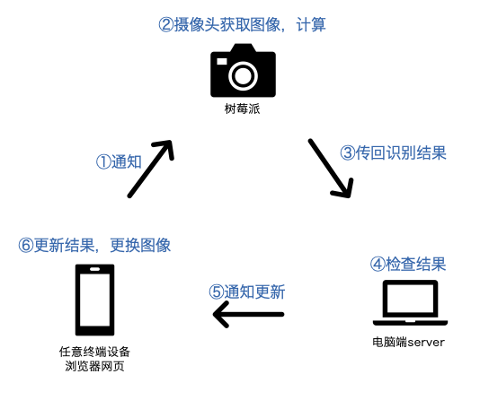

# 树莓派图像识别

## 整体架构

电脑端flask server和浏览器界面、树莓派分别建立socket连接。浏览器初始化后重复以下操作：

1. 浏览器通知server图片已更新
2. server等待0.5s后（树莓派获取图像有延迟，可以修改等待时间`display_delay`）通知树莓派进行图像识别，并开始计时
3. 树莓派将识别结果和系统信息通过post方法传回server
4. server检查结果、计算用时和准确率
5. server通知浏览器更新
6. 浏览器更新结果数据和图像



## 安装&运行

### ip设置

+ 获得树莓派ip地址`pi_ip`和电脑端ip地址`server_ip`
+ 在`server/app.py`中修改`pi_ip`
+ 在`pi/classify_picamera.py`中修改`server_ip`和`pi_ip`

### PC端

+ `server`文件夹下运行

  ```
  flask run --host='0.0.0.0'
  ```

  在任意终端设备浏览器上打开`http://{server_ip}:5000/`。

### 树莓派

+ 安装并运行mjpg-streamer

  + 安装：需要先安装依赖库，然后下载源码编译，参考[https://github.com/cncjs/cncjs/wiki/Setup-Guide:-Raspberry-Pi-%7C-MJPEG-Streamer-Install-&-Setup-&-FFMpeg-Recording](https://github.com/cncjs/cncjs/wiki/Setup-Guide:-Raspberry-Pi-|-MJPEG-Streamer-Install-&-Setup-&-FFMpeg-Recording)

  - 运行：

    ```
    /usr/local/bin/mjpg_streamer -i "input_uvc.so -r 640x360 -d /dev/video0 -f 30" -o "output_http.so -p 8080 -w /usr/local/share/mjpg-streamer/www"
    ```

  - 640x360表示推流分辨率，8080表示端口号，都可以自行调整，适当调低分辨率可以减少延迟

  - 浏览器打开`http://{pi_ip}:8080`即为mjpg-streamer自带页面，想直接获取视频内容可以在html中使用标签``

+ 安装opencv、tflite等

+ 将`pi/`文件夹拷贝至树莓派，运行

  ```
  python3 classify_picamera.py --model model.tflite --labels synset_words.txt
  ```

+ 树莓派对准浏览器界面上的图像，刷新浏览器后开始运行

## 图像识别

+ 验证集包含100张图片，在界面上随机显示，全部显示一遍后重新开始下一轮随机。
+ 测试集包含100张图片，同样为随机显示。测试集未公开，检查时只需要将测试集的图像和GT拷贝至电脑端`server/static`文件夹，并在`server/app.py`中修改mode参数为"test"即可。

## 模型转换

`converter`文件夹下为一个模型转换示例。


